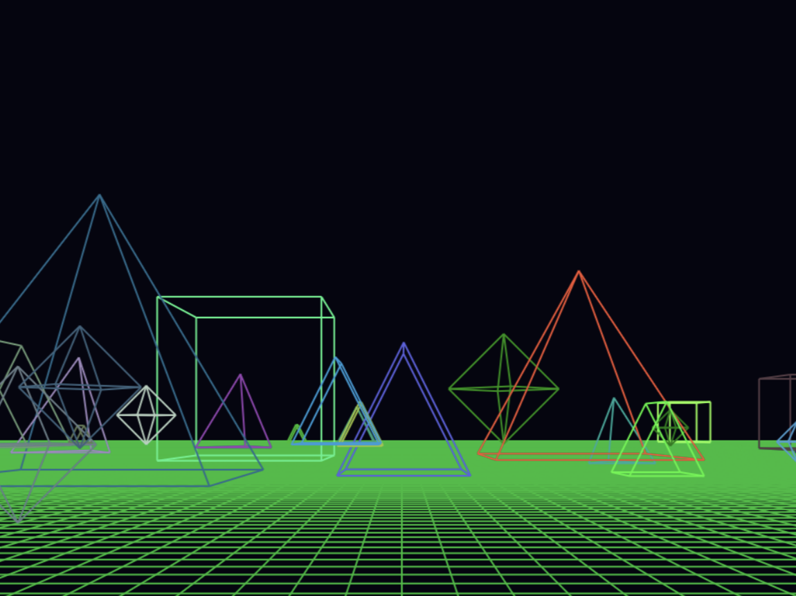
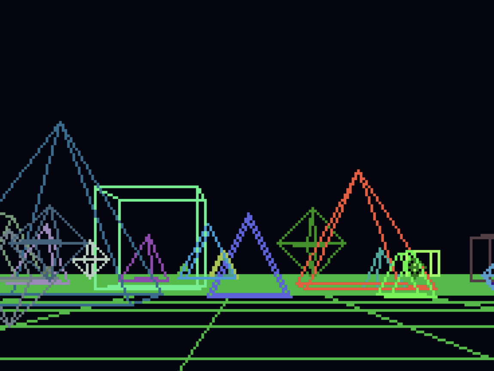
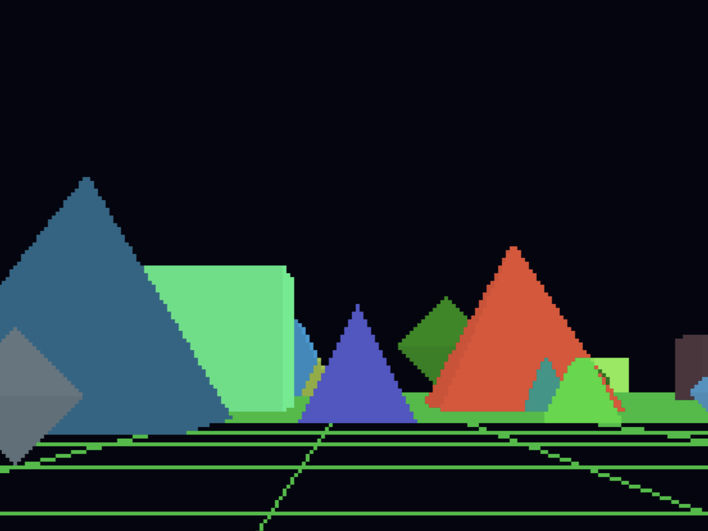
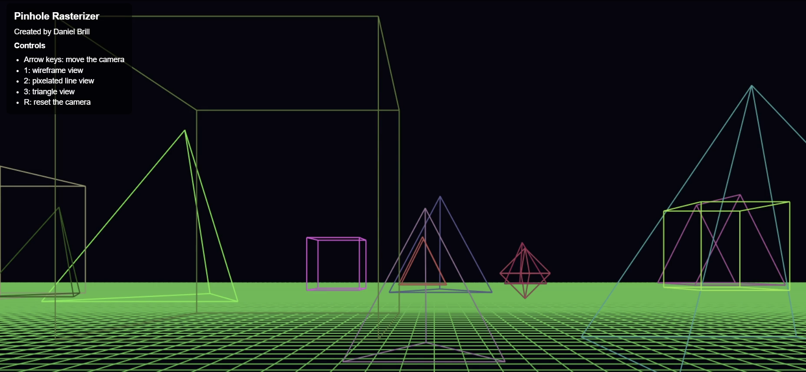
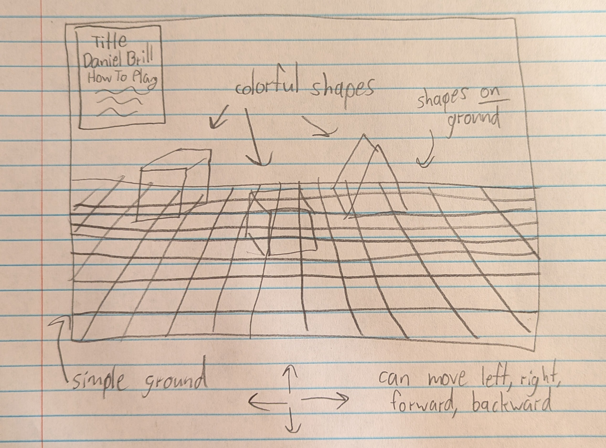

# CS 5160 Project 1 | Pinhole Rasterizer

    
    

    
    

    

This repo was built for Project 1 of CS 5160, Computer Graphics. It features an interactive 3D art scene that projects colorful shapes onto a 2D display using pinhole rasterization logic. It includes three viewing modes: wireframe view, pixelated line view, and triangle view. Wireframe view uses the HTML Canvas to draw wireframe geometric shapes in high resolution. Pixelated line view creates a mock 320 x 200 pixel canvas to convert the same scene into pixel art. Lastly, triangle view is an extension of pixelated line view, using Barycentric coordinates to fill in shapes' faces with triangle primitives.

## Table of Contents

- [Try It!](#try-it)
- [Design](#design)
  - [Sketch](#sketch)
- [Implementation Details](#implementation-details)
  - [Modeling 3D Objects](#modeling-3d-objects)
  - [Pinhole Camera Projection](#pinhole-camera-projection)
  - [Drawing Lines](#drawing-lines)
  - [Manual Line Rasterization](#manual-line-rasterization)
  - [Triangle Drawing](#triangle-drawing)
  - [Depth Buffer and Visible Surface Testing](#depth-buffer-and-visible-surface-testing)
- [AI Usage](#ai-usage)
- [Future Improvements](#future-improvements)

## Try It!

This project is hosted publicly using GitHub Pages at [https://danielbrill20.github.io/cs5160-pinhole-rasterizer](https://danielbrill20.github.io/cs5160-pinhole-rasterizer). The instructions are on screen, but I'll also provide them here:

### Controls

- **Arrow Keys**: Use the `arrow keys` to move side to side and forward and backwards through the scene.
- **Number Keys 1-3**: Use keys `1`, `2`, and `3` to switch between `wireframe view`, `pixelated line view`, and `triangle view` as you please.
- **R Key**: Press `R` to reset the camera back to the starting position.
- **Refresh**: You can also refresh your browser to regenerate a new scene!

## Playthrough Demo (Click to view on Vimeo)

## Design

The goal of this project was to build a simple but educational rasterizer that could render a 3D scene using the same core ideas we discussed in class. I wanted the viewer to be able to move through the environment, compare rendering styles, and observe how a scene changes when the same geometry is represented as edges, pixels, or filled triangles.

### Sketch

My original design was a minimal 3D scene with a camera, a ground plane, and several shapes. I wanted the interface to stay simple and readable, while still making the graphics pipeline easy to understand from a student perspective.

## Implementation Details

### Modeling 3D Objects

The project models 3D objects as collections of vertices, edges, and later triangular faces. Each object is defined by its geometry, and then transformed in space by scaling, translation, and camera-relative motion. This is directly connected to the class concept of representing 3D models as data rather than as abstract shapes; in other words, a mesh is just a set of points connected by edges and faces.

### Pinhole Camera Projection

The camera in this project follows the pinhole camera model. Objects are first translated relative to the camera position, then projected onto a virtual image plane by dividing the x and y coordinates by z. That is exactly the logic behind perspective projection: farther objects appear smaller, while closer objects appear larger.

This connects directly to lecture topics on perspective projection and the pinhole camera. The camera is effectively a point in space, and each 3D point is projected onto a 2D plane according to the viewing direction and distance.

### Drawing Lines

The wireframe and pixelated modes both rely on edge drawing. Each edge connects two vertices in the scene, and the code computes the screen-space endpoints of that edge before drawing it. This reflects an important graphics concept: a 3D object can be represented as a connected network of edges, and those edges can be projected into 2D as line segments.

Because the system is intentionally simple, the edge drawing logic is a direct implementation of a classic rasterization problem: take a geometric line and decide which pixels to color.

### Manual Line Rasterization

The function that draws the pixelated line does more than just call a canvas API. It calculates the line direction, clips the line to the visible raster bounds, and then steps through the grid using a Bresenham-style error accumulation approach (I had to look this up!). This is a great example of how a continuous mathematical line becomes a discrete set of pixels on a display.

This connects strongly to the course because digital displays are pixel grids, not continuous planes. Even if the original geometry is smooth, the final image must be sampled into discrete cells. The code therefore approximates the line by choosing the nearest valid pixel locations.

### Triangle Drawing

The triangle mode is where the project moves from basic edge drawing to surface filling. The renderer creates triangular faces from the shape data, projects those triangles into screen space, and tests pixels inside the projected triangle using barycentric coordinates. This directly connects to the class discussion of triangles as the basic primitive for many software renderers.

The function for barycentric interpolation checks whether a point lies inside the triangle and, if so, computes the interpolated depth at that pixel. This is a crucial concept because triangle filling is one of the most common ways to draw 3D surfaces in graphics.

### Depth Buffer and Visible Surface Testing

The triangle mode also uses a depth buffer to determine which parts of the scene are visible. Each raster pixel stores the closest depth value seen so far, and any new pixel only overwrites it if it is closer to the camera. This is the implementation of the z-buffer algorithm, one of the standard approaches used in real graphics pipelines.

This is especially relevant to the course because it directly connects to the topic of hidden-surface removal. Even if two triangles occupy the same screen position, the one with the smaller depth is the visible one.

## AI Usage

I sped up development by using AI to generate a few additional shapes, specifically the octahedron and triangular prism. I also used AI to quickly create the vertices for triangular faces in `./shapes.js`. This eliminated the need for me to manually calculate everything, but I ensured I understood the concepts by doing the cube and pyramids manually.

Also, for the `triangle view`, I originally coded the shapes to take on the same randomly generated colors as their wireframe counterparts. However, I didn't like that the faces all blended together, and it was hard to distinguish between different sides of the shapes due to lack of shadows. As a quick fix, I prompted AI to make the faces different colors. It quickly generated some random color shift logic that I used, as it was not the focus of this project. Its original implementation randomly shifted the color of each triangle, so I adjusted it to ensure that triangles of a single face are one solid color.

## Future Improvements

This project is a solid foundation, but there are a few ways I would improve it next. I would start by adding more advanced scene geometry so the models are less abstract and more visually interesting. I would also like to improve the lighting model so the shapes have more depth and realism rather than flat colors alone.

Another improvement would be to add more flexible camera controls, such as mouse-based rotation or smoother movement. This would make the viewer feel more natural and would allow for easier exploration of the scene.

This project was also a useful place to experiment with incomplete or partially explored ideas. Some of the earlier directions I considered included more detailed surface shading or even physics-like interactions. While those ideas could not all be fully completed before the deadline, they helped shape the final project and gave me a stronger understanding of the rendering pipeline as a whole.
